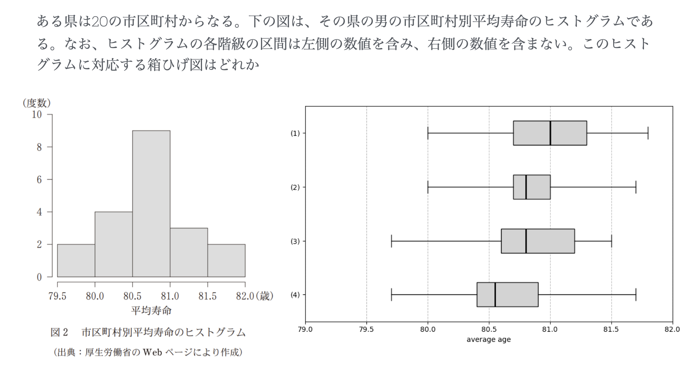
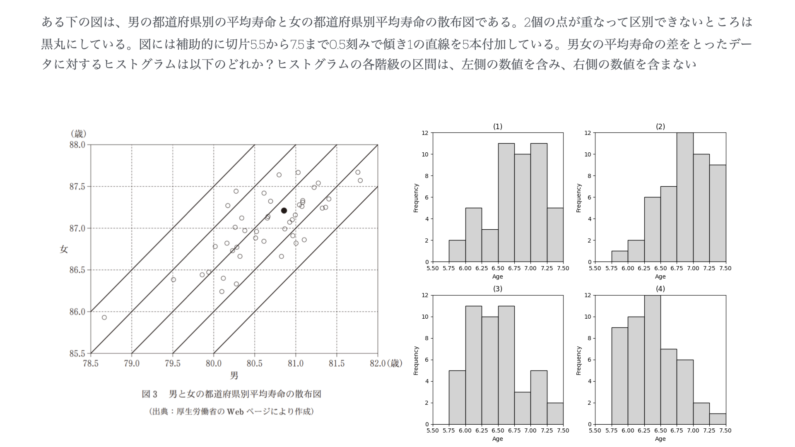
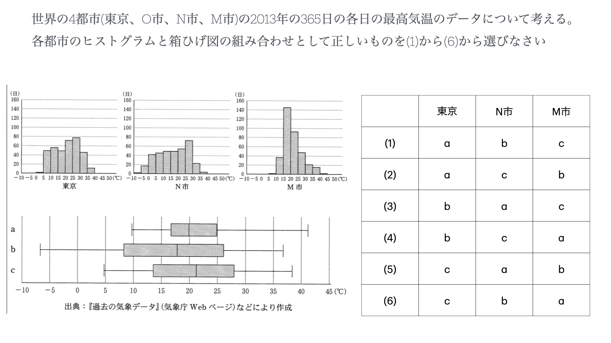

# Experiment_Eye-tracking

## 課題
- データの読み取りに際して、しばしば誤読することやそもそも読み方が、暗黙知的な側面が考えられます。
- そこで、本実験では、表やデータの読み取りについての正答率や時間、視線の動きをもとに考察し、研究の見せ方についての応用を目的とする

## 問題内容
### 問題1

- ヒストグラムの階級について適切な箱ひげ図を選ぶ問題
- 正解 : 4

### 問題2

- 散布図から適切なヒストグラム選ぶ問題
- 差をどのように捉えることができるかが大事
- 正解 : 4
### 問題3

- 散布図から自然言語の選択肢選ぶ問題
- 図から文字への変換
- 正解 : 3
### 問題4

- ヒストグラムと箱ひげ図の積雪な組み合わせを選ぶ問題
- 特徴が捉えやすいと思うので、簡単かも
- 正解 : 6